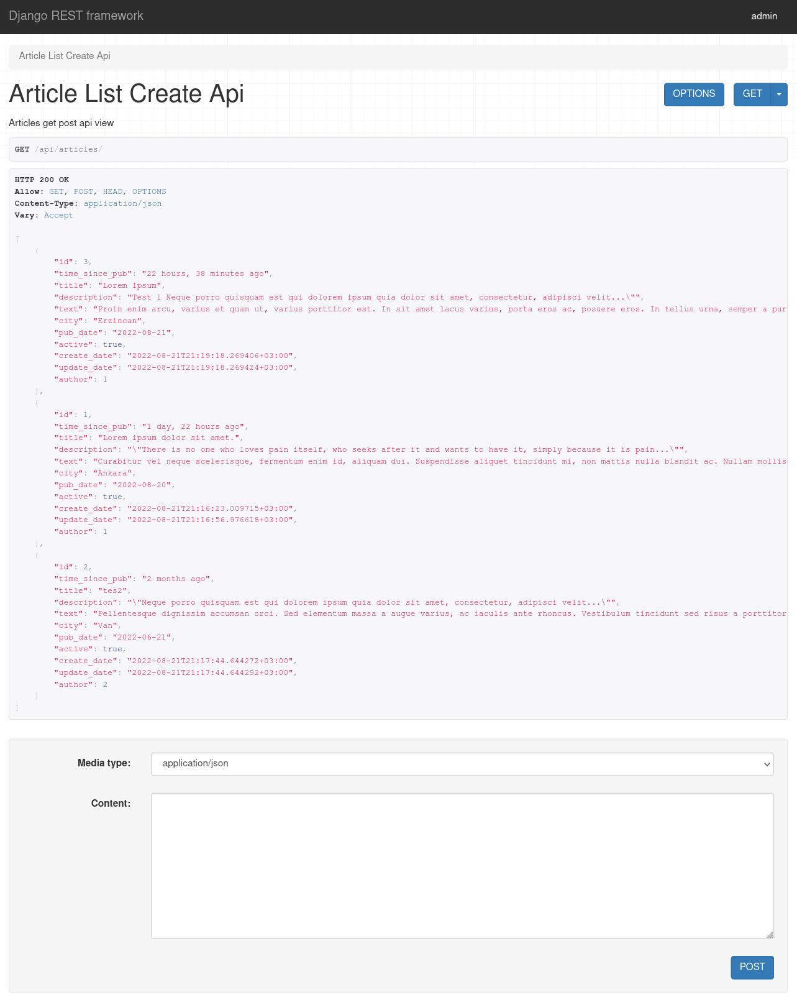
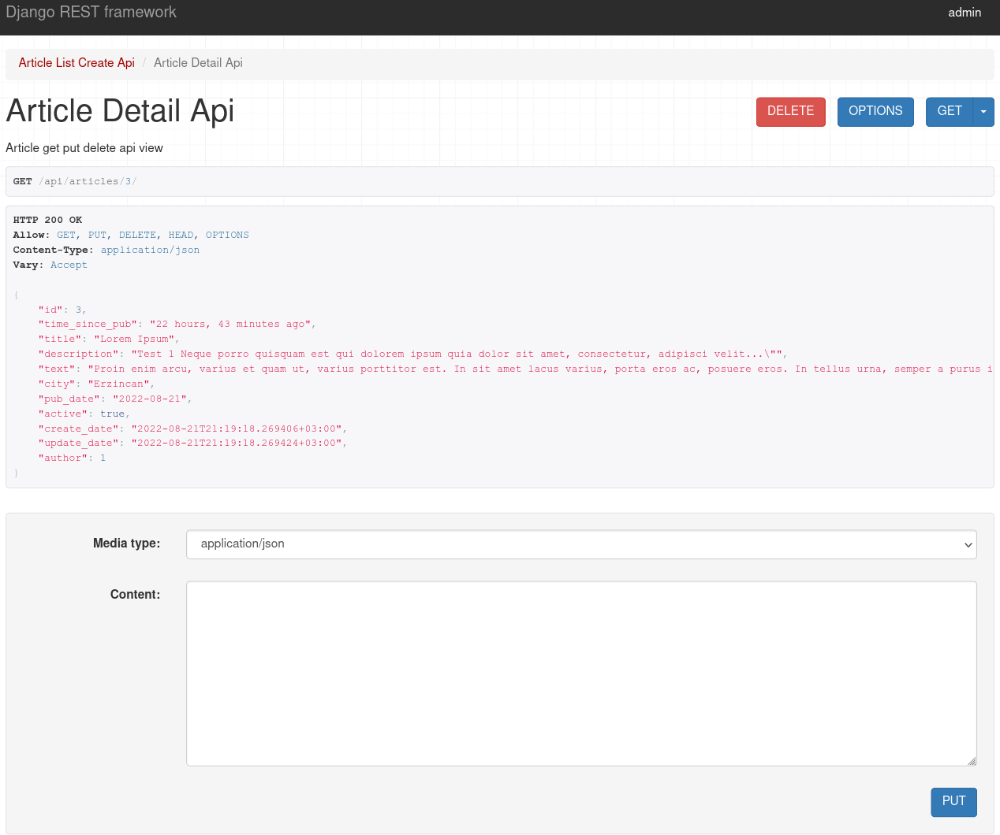
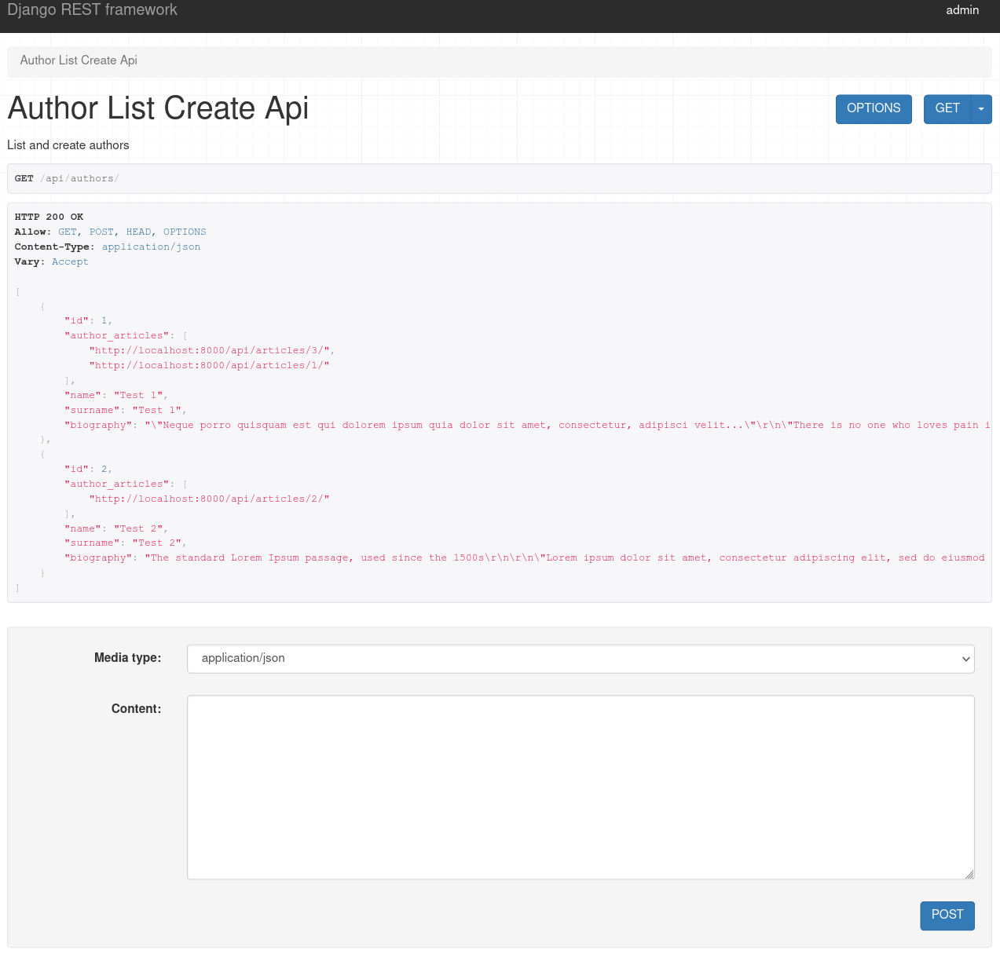

## Basic a Sample Article and Author REST API App - Django Rest Framework
<br />
<p align="center">

<table>
<tr><td>
</td><td>

</td></tr>
<tr><td colspan="2">

</td></tr>
</table>
</p>
<br />

###### API Usage
- /api/articles/
* Article create-post, list-get
- /api/articles/id/
* A article update-put, delete-delete
- /api/authors/
* Author create-post, list-get
<br/>

### Installing

- To get this repository, run the following commands inside your terminal

```bash
svn export https://github.com/emrekndl/DjangoApps/trunk/RestApiArticlesApp
```

```bash
cd RestApiArticlesApp
```

```bash
pip3 install -r requirements.txt
```

```bash
cd django_rest_api
```

```bash
python3 manage.py makemigrations
```

```bash
python3 manage.py migrate
```

```bash
python3 manage.py createsuperuser
```

```bash
python3 manage.py runserver
```

###### Tools

<br>
[Django Rest Framework](https://www.django-rest-framework.org/)

