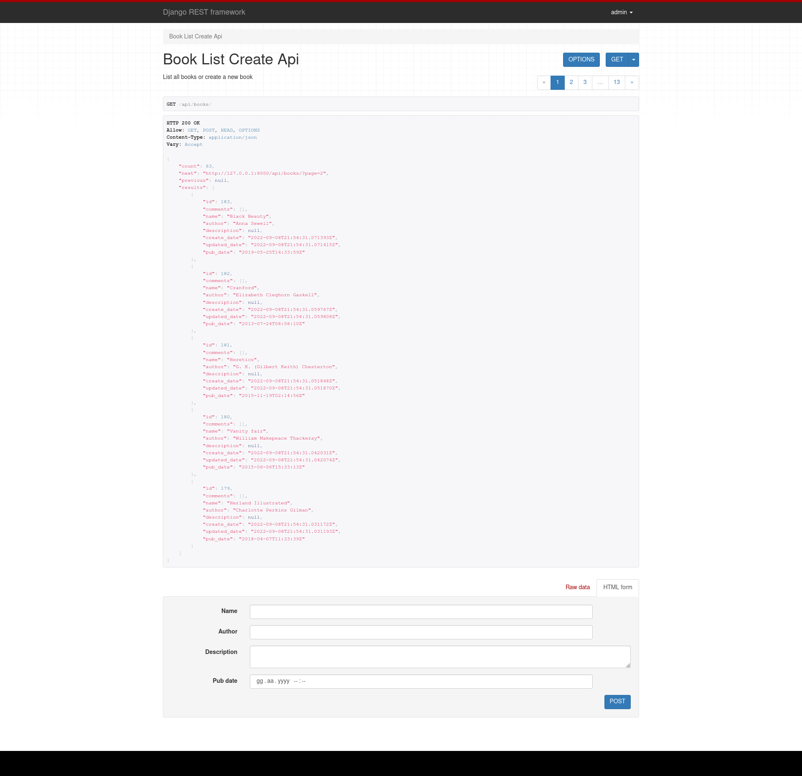
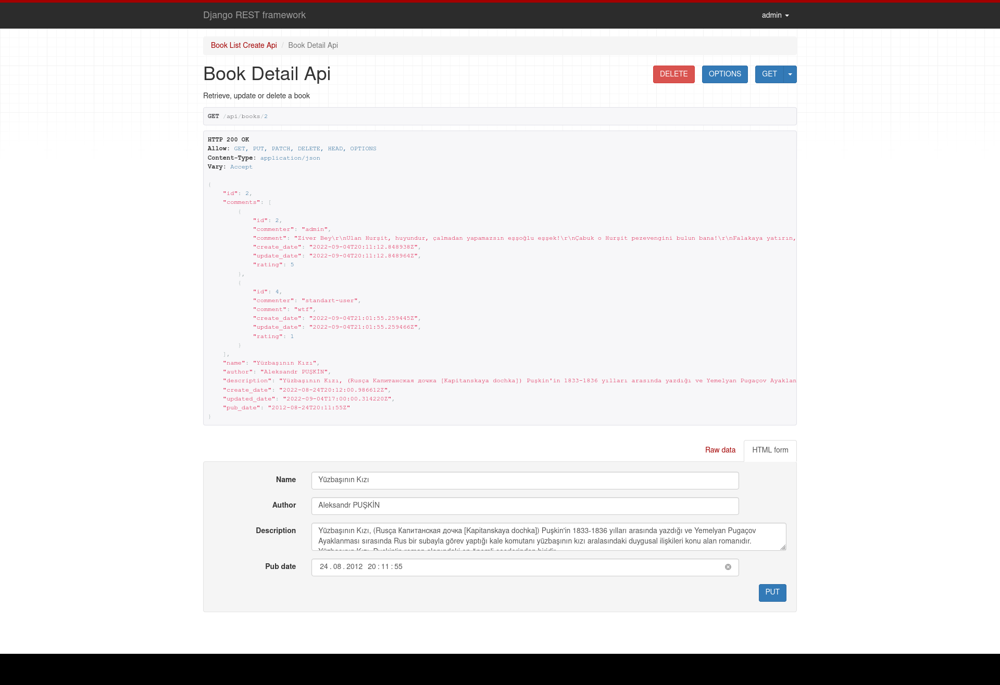
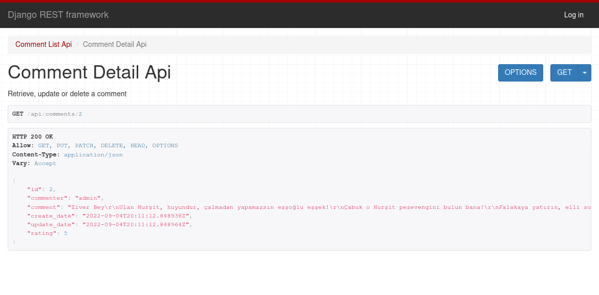
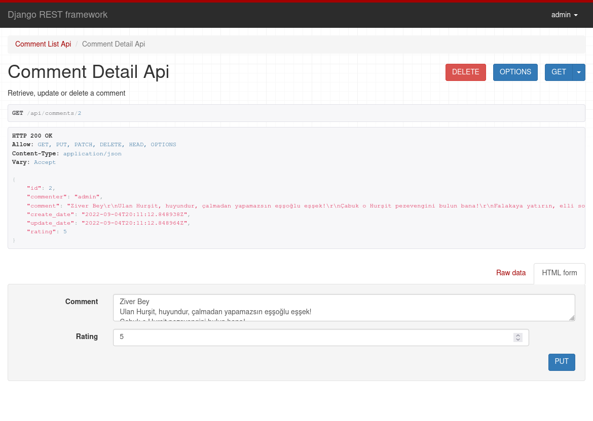
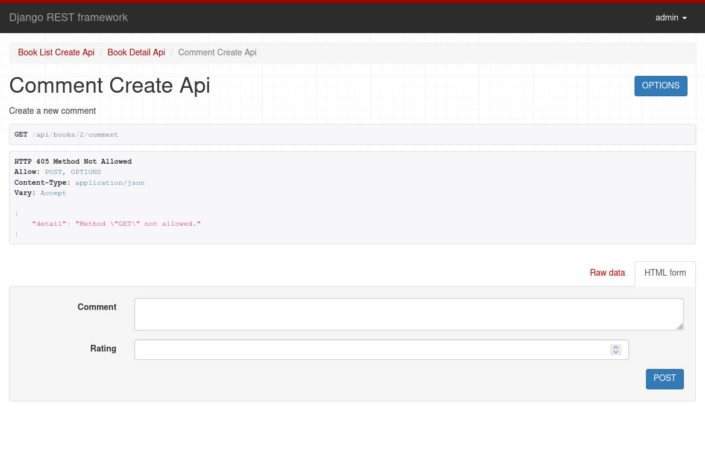

## Sample Bookstore REST API App - Django Rest Framework - GenericAPIView
<br />
<p align="center">

<table>
<tr><td>
</td><td>
</td></tr><tr><td>
</td><td>
</td>
</tr><tr>
<td colspan="2">
</td></tr>
</table>
</p>
<br />

###### API Usage
- /api/books/
* Book create-post, list-get
- /api/books/id/
* A book update-put, delete-delete
- /api/books/book_pk/comment/
* Create a comment to related book
- /api/comments/
* Commeent list-get
- /api/comments/id/
* A comments update-put, delete-delete
<br/>


### Installing

- To get this repository, run the following commands inside your terminal

```bash
svn export https://github.com/emrekndl/DjangoApps/trunk/RestGenericApiBooksApp
```

```bash
cd RestGenericApiBooksApp
```

```bash
pip3 install -r requirements.txt
```

```bash
cd bookstore_app
```

```bash
python3 manage.py makemigrations
```

```bash
python3 manage.py migrate
```

```bash
python3 manage.py createsuperuser
```

```bash
python3 manage.py runserver
```

###### Tools

<br>
[Django Rest Framework](https://www.django-rest-framework.org/)

