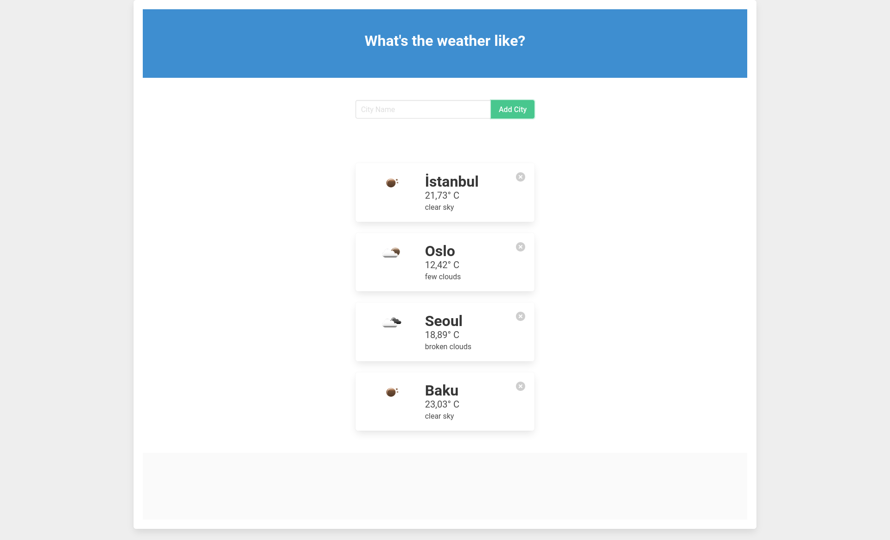

## Sample Weather App - with OpenWeatherMap API
<br />
<p align="center">

<table>
<tr><td>
</td>
</tr>
</table>
</p>
<br />


### Installing

- To get this repository, run the following commands inside your terminal

```bash
svn export https://github.com/emrekndl/DjangoApps/trunk/djangoWeatherApp
```

```bash
cd djangoWeatherApp
```

```bash
pip3 install -r requirements.txt
```

```bash
cd djangoWeatherApp
```
- *Note:* First you need to add "views.py" file to "appid". From https://openweathermap.org/

```bash
python3 manage.py makemigrations
```

```bash
python3 manage.py migrate
```

```bash
python3 manage.py createsuperuser
```

```bash
python3 manage.py runserver
```

###### Tools

<br/>
[OpenWeatherMap](https://openweathermap.org/)

