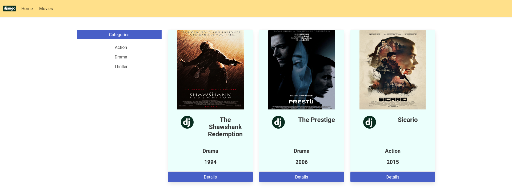

## Simple Movie App - Django
<br />
<p align="center">

<br />
</p>
<br />
<br />
## Setup

To get this repository, run the following commands inside your terminal

```bash
$ svn export https://github.com/emrekndl/DjangoApps/trunk/movieAppDjango
```

```bash
$ cd movieAppDjango
```

```bash
$ pip3 install -r requirements.txt
```

```bash
$ cd movieapp
```

```bash
$ python3 manage.py makemigrations
```

```bash
$ python3 manage.py migrate
```

```bash
$ python3 manage.py createsuperuser
```

```bash
$ python3 manage.py runserver
```

